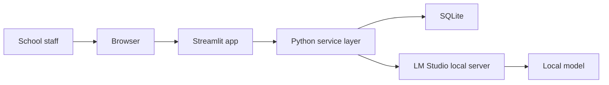

# Sekretariat-Copilot (GER) aka Secretary Copilot (ENG)


Free, local-first AI for school offices.

Turn messy parent emails, typed phone notes, screenshots, and PDFs into clean, review-ready admin outputs on a school-controlled machine.

This repo is public on purpose. It is both:

1. a free working tool for school administration workflows
2. a live proof-of-work for privacy-first AI product and deployment services

It is built for European schools that want useful AI without defaulting to US cloud dependency, recurring token bills, or vague pilot theatre.

---

## Start Here

| If you are... | Start here | Why |
| --- | --- | --- |
| A principal, school leader, governor, or decision-maker | [School Leader Brief](docs/SCHOOL_LEADER_BRIEF.md) | Get the value, risk posture, and pilot shape in a few minutes |
| A school office administrator or educator | Read this README from top to bottom | Understand the use case in plain language |
| An IT lead, DPO, or technical reviewer | [IT Deployment Guide](docs/IT_DEPLOYMENT.md) | Get the install, rollout, and governance path |
| Planning a first trial | [Pilot Checklist](docs/PILOT_CHECKLIST.md) | Scope a credible first pilot without confusion |
| Evaluating common concerns | [FAQ](docs/FAQ.md) | Get short answers to the usual questions |

---

## What This Means for a School Office

School administration is full of repetitive work that still needs care:

- absence messages
- parent replies
- phone notes
- meeting summaries
- document triage
- copy-paste into legacy systems

Most of this work is not hard.
It is just constant.

Sekretariat-Copilot helps staff turn messy inputs into a clean case pack:

- structured facts
- a short internal brief
- three subject line options
- three draft reply styles
- warnings where information is missing
- clarifying questions when the source is unclear

The point is simple:

**staff stay in control, the tool does the repetitive drafting work, and nothing is sent automatically.**

---

## Why This Project Stands Out

Many AI pilots fail because they start too wide, look too vague, or depend too quickly on external cloud services.

Sekretariat-Copilot is different by design.

- It is narrow.
  It solves one clear class of work: school administration handling.
- It is local-first.
  The app and model can run on the same machine.
- It is human-in-the-loop.
  Every output is reviewed before use.
- It is easier to defend.
  Local processing removes a large amount of avoidable cloud complexity at the start.
- It is easier to trial.
  One pilot machine is enough.
- It is cheaper to explore.
  Local models mean no default per-token billing.
- It is public and inspectable.
  IT staff can review the repo, architecture, prompts, and tests directly.

That makes it easier to explain to school leaders, administrators, and technical reviewers at the same time.

---

## Why Local-First Matters in Europe

Many European schools are not comfortable sending routine school communications through external AI clouds by default.

That concern is reasonable.

If personal data is processed by a US-controlled cloud provider, schools may need to think carefully about:

- third-country transfer exposure
- vendor and sub-processor risk
- contractual safeguards
- supervisory guidance
- access by foreign authorities
- the practical meaning of the US CLOUD Act

This repo does not claim that every US vendor is automatically unlawful in every case.

It makes a narrower and more useful point:

**if you can keep routine drafting and extraction work on a school-controlled machine, you remove a large amount of avoidable cloud complexity from the start.**

That matters for trust.
That matters for procurement.
That matters for governance.
That matters for the everyday confidence of staff.

---

## What a School Gets

For a typical case, the app returns:

- structured admin facts
- a concise internal case brief
- exactly three subject lines
- exactly three draft variants
- visible warnings
- clarifying questions when needed

The three reply styles always follow the same order:

1. Hemingway-style
2. Corporate
3. Educator-first

That consistency matters in office work.

---

## What a Good First Pilot Looks Like

Start small.

Use the repo to test one narrow promise:

**Can this save the school office time on repetitive drafting without creating new trust problems?**

Recommended first pilot:

1. one school office workflow owner
2. one dedicated pilot machine
3. synthetic fixtures first
4. text and digital PDFs first
5. image OCR only after the core path feels stable
6. no real sensitive material until the local process is understood

This is how you avoid pilot purgatory.

---

## The Operator Experience

No prompt engineering is needed.

1. Open the app in a browser on the local machine.
2. Paste a message, type a note, or upload a file.
3. Leave workflow detection on auto, or choose a workflow.
4. Click `Process locally`.
5. Review the facts, brief, subjects, and drafts.
6. Edit if needed.
7. Copy the final text into email or the school system.
8. Click `Reset case`.

That is the whole loop.

---

## Architecture at a Glance



Default posture:

- bind to `127.0.0.1`
- keep intranet mode off
- treat raw source material as transient
- store only derived outputs and minimal audit metadata
- never auto-send communication

---

## What It Does

- accepts pasted text, typed notes, images, and PDFs
- detects the likely workflow and lets staff override it
- extracts facts locally
- drafts clean copy-ready outputs
- flags missing or contradictory information
- exports text, JSON, and CSV
- stores only minimal local audit metadata by default

---

## What It Refuses to Do

- auto-send emails
- guess mandatory missing facts
- process multi-child cases in MVP
- pretend low-quality OCR is reliable
- support handwritten cursive
- behave like an autonomous decision-maker

That restraint is deliberate.

---

## Why the Cost Model Is Attractive

If you run this with local models:

- there are no per-token API fees
- there is no mandatory AI SaaS subscription
- there is no cost spike when staff use it more

There are still real costs:

- hardware
- setup
- maintenance
- support

But there is no default meter running every time someone drafts a reply.

---

## GDPR and EU AI Act Positioning

This repo is designed to be more governance-friendly.
It is not a magic compliance certificate.

The design supports sensible choices such as:

- local processing by default
- limited logging
- human review before use
- no auto-send
- clear warnings on low-confidence cases
- clear blocking of unsupported cases

This MVP is meant for:

- drafting
- summarising
- extracting facts
- generating clarifying questions

It is not meant for:

- grading
- admissions decisions
- behavioural monitoring
- automated disciplinary decisions

Schools still need their own review of:

- lawful basis
- retention
- access control
- staff guidance
- DPIA needs
- local and national education rules

In short:

**this tool is built to support a safer local-first posture, not to replace legal or policy review.**

---

## Docs by Audience

### For school leaders

- [School Leader Brief](docs/SCHOOL_LEADER_BRIEF.md)
- [Pilot Checklist](docs/PILOT_CHECKLIST.md)
- [Demo Runbook](docs/DEMO_RUNBOOK.md)

### For school offices and educators

- [FAQ](docs/FAQ.md)
- [Fixtures overview](fixtures/README.md)

### For IT, DPO, and technical reviewers

- [IT Deployment Guide](docs/IT_DEPLOYMENT.md)
- [Privacy Note](docs/PRIVACY.md)
- [Windows Setup Guide](docs/WINDOWS_SETUP.md)
- [Troubleshooting Guide](docs/TROUBLESHOOTING.md)

### For contributors and reviewers

- [Contributing Guide](CONTRIBUTING.md)
- [Security Policy](SECURITY.md)

---

## LM Studio in Plain Terms

LM Studio is the recommended local model host for this repo.

Why:

- it gives schools a visible desktop app
- it runs well on Apple Silicon
- it exposes an OpenAI-compatible local endpoint
- it is easier for non-AI specialists than building an inference stack from scratch

The app talks to LM Studio through `http://127.0.0.1:1234/v1`.

That keeps the app portable.
If a school later wants a different OpenAI-compatible local backend, the service layer is already designed for that.

Full setup instructions are in the [IT deployment guide](docs/IT_DEPLOYMENT.md).

---

## Repository Layout

- `app/` Streamlit UI, styles, launcher, and copy helpers
- `core/` typed models, config, storage, and text utilities
- `services/` analysis, ingestion, output generation, export, backend, and orchestration
- `prompts/` prompt templates
- `fixtures/` synthetic regression fixtures and demo material
- `tests/` automated tests
- `docs/` audience guides, deployment notes, privacy note, troubleshooting, and demo material

---

## Developer Checks

```bash
ruff check .
mypy app core services
pytest
```

Run the app:

```bash
sekretariat-copilot
```

---

## Why This Repo Is Free

I am giving this away for free because the repo itself is useful.

It helps schools and organisations:

- evaluate a real local-first AI workflow
- understand what a calm, governable AI product can look like
- test a narrow use case before buying something large

It also shows how I work:

- from idea to product
- from policy concern to system design
- from UX to implementation
- from GitHub proof to deployable demo

The software is free.
The deeper value is in adaptation, rollout, training, and institution-ready implementation.

---

## If You Want to Work With Me

This repo is a free public deliverable.
It is also a signal.

If you want help turning local-first AI into something your school or organisation can actually use, I can support work such as:

- workflow discovery
- school-specific prompt and policy design
- privacy-first rollout planning
- local deployment setup
- stakeholder demos
- training for administrators and educators
- proof-of-concept to production pathway design

---

## Further Reading

- [EU AI Act official text (EUR-Lex)](https://eur-lex.europa.eu/eli/reg/2024/1689/oj)
- [EU AI Act summary (EUR-Lex)](https://eur-lex.europa.eu/EN/legal-content/summary/rules-for-trustworthy-artificial-intelligence-in-the-eu.html)
- [GDPR official text (EUR-Lex)](https://eur-lex.europa.eu/eli/reg/2016/679/oj)
- [GDPR summary (EUR-Lex)](https://eur-lex.europa.eu/EN/legal-content/summary/general-data-protection-regulation-gdpr.html)
- [EDPS 2024 Microsoft 365 decision summary](https://www.edps.europa.eu/press-publications/press-news/press-releases/2024/european-commissions-use-microsoft-365-infringes-data-protection-law-eu-institutions-and-bodies)
- [EDPS 2025 follow-up on Commission compliance](https://www.edps.europa.eu/press-publications/press-news/press-releases/2025/european-commission-brings-use-microsoft-365-compliance-data-protection-rules-eu-institutions-and-bodies_en)
- [US DOJ CLOUD Act resources](https://www.justice.gov/dag/cloudact)
- [LM Studio docs](https://lmstudio.ai/docs/)
- [LM Studio local server docs](https://lmstudio.ai/docs/developer/core/server)
- [LM Studio offline operation docs](https://lmstudio.ai/docs/app/offline)

---

## Bottom Line

If your school wants a first serious step into AI without defaulting to cloud dependency, subscription creep, and governance chaos, this repo is a practical place to start.

It is not a full school platform.
It is not legal advice.
It is not auto-pilot.

It is a focused local-first administrative sidecar designed to save staff time while keeping people, oversight, and trust in the loop.

---

## Contact

If you want to explore a pilot, a local-first rollout, or a custom version for your school or organisation, I would be glad to speak with you.

**Elias Kouloures**
US-Speed + EU-Safeguards + Award-Winning Creativity

Homezone: Berlin, Germany

Videocall: [calendar.app.google/ANb76KDuvg4J7LS28](https://calendar.app.google/ANb76KDuvg4J7LS28)

E-Mail: [Elias.Kouloures@gmail.com](mailto:Elias.Kouloures@gmail.com)

Website: [EliasKouloures.com](https://EliasKouloures.com)

Videos: [YouTube.com/@EliasKouloures](https://YouTube.com/@EliasKouloures)

Business: [LinkedIn.com/in/eliaskouloures/](https://LinkedIn.com/in/eliaskouloures/)
