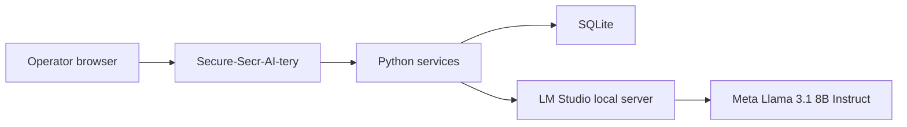

# IT Deployment Guide

This guide is for school IT teams, DPO reviewers, and technical operators.

Secure-Secr-AI-tery is a local desktop web app with:

- a Streamlit front end
- a Python service layer
- a local SQLite database
- a local LM Studio server
- a local model

It is **not**:

- a SaaS tenant
- an autonomous agent
- an email sender
- a school MIS replacement

## Deployment Model

Recommended first deployment:

1. one dedicated Mac or Windows machine
2. one named staff account
3. local-only binding on `127.0.0.1`
4. LM Studio running on the same machine
5. no intranet exposure at the start

## Architecture



## What Is Stored Locally

SQLite stores local run history so users can reopen old work:

- history title
- typed context
- saved prompt title
- saved prompt body
- output text
- uploaded file names
- audit metadata

Uploaded file bodies are not required for history and should stay transient.

## Recommended LM Studio Model

Use:

- `meta-llama-3.1-8b-instruct`

Why:

- steadier than the uncensored variant for school-office writing
- good balance for a 16 GB Apple Silicon machine
- reliable for short prompt-driven drafting and summarising tasks

## Recommended LM Studio Inference Settings

From top to bottom in LM Studio:

- `Preset`: save one as `Secure-Secr-AI-tery Stable`
- `System Prompt`: leave empty
- `Temperature`: `0.2`
- `Limit Response Length`: `Off`
- `Context Overflow`: `Truncate Middle`
- `Stop Strings`: leave empty
- `CPU Threads`: `6`
- `Top K Sampling`: `20`
- `Repeat Penalty`: `1.05`
- `Top P Sampling`: `0.85`
- `Min P Sampling`: `Off`
- `Structured Output`: `Off`
- `Speculative Decoding`: `Off`
- `Draft Model`: none

These settings favour stable office writing over creativity.

## Get The Repo

```bash
git clone https://github.com/EliasKouloures/secure-secr-ai-tery.git
cd secure-secr-ai-tery
```

The GitHub repo slug is `secure-secr-ai-tery`.
The product name inside the app is `Secure-Secr-AI-tery`.

## macOS Install

```bash
python3 --version
python3 -m venv .venv
source .venv/bin/activate
python -m pip install --upgrade pip
python -m pip install -e '.[dev]'
cp config.example.toml config.toml
```

If `python3` is not found:

```bash
python --version
python -m venv .venv
```

## Windows Install

See the dedicated [Windows Setup](WINDOWS_SETUP.md) page for the cleanest path.

Fast path:

```powershell
py -3 -m venv .venv
.venv\Scripts\Activate.ps1
python -m pip install --upgrade pip
python -m pip install -e ".[dev]"
Copy-Item config.example.toml config.toml
```

## Config

`config.toml`:

```toml
[app]
title = "Secure-Secr-AI-tery"
bind_host = "127.0.0.1"
bind_port = 8501

[backend]
provider_name = "lm_studio"
base_url = "http://127.0.0.1:1234/v1"
model_id = "meta-llama-3.1-8b-instruct"
temperature = 0.2
max_tokens = 900
timeout_seconds = 120
supports_vision = false
```

Important:

- `model_id` must match the loaded LM Studio server model
- `supports_vision` should stay `false` unless you deliberately move back to OCR-capable workflows
- `bind_host` should stay `127.0.0.1` for the first deployment

## Launch

Preferred command:

```bash
secure-secr-ai-tery
```

Legacy fallback:

```bash
sekretariat-copilot
```

Direct path fallback:

```bash
.venv/bin/secure-secr-ai-tery
```

## What Operators See

The UI is intentionally simple:

- `History` on the left
- `Context, Info & 2do's` in the centre
- `AI Output` below it
- `Prompts` and the full prompt editor on the right

This keeps the app understandable for non-technical staff.

## First Acceptance Check

Confirm that the operator can:

1. open the app
2. write context into the upper middle box
3. upload one file if needed
4. choose or save a prompt
5. click `Run Prompt`
6. copy the result from `AI Output`
7. reopen the run from `History`

## Governance Notes

This project helps with a stronger privacy posture.
It does **not** remove the need for school-level review.

Check locally:

- legal basis for the intended use
- staff guidance
- local retention policy
- access control for the pilot machine
- whether a DPIA is needed for the chosen workflow scope

## Practical Rollout Advice

Start narrow.

Recommended first pilot:

1. the six built-in prompts first
2. text-first work
3. one school office owner
4. synthetic material first
5. short real-world test after internal sign-off

## Troubleshooting

Go to [Troubleshooting](TROUBLESHOOTING.md) for:

- LM Studio not reachable
- wrong model loaded
- launcher not found
- slow generations
- prompt library questions
